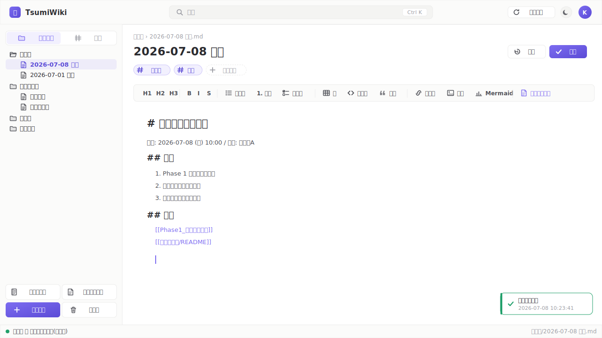

# 02. 基本操作

TsumiWikiの日常的な使い方をまとめます。エディタの機能詳細は [03. エディタとMarkdown](03_エディタとMarkdown.md)、進んだ機能は [04. 便利機能](04_便利機能.md) を参照してください。

## 2.1 ログイン

1. ブラウザで TsumiWiki のURL(例: `http://your-server:3000/`)を開きます。
2. ユーザーIDとパスワードを入力し **[ログイン]** をクリックします。
3. ログインに成功するとメイン画面が開きます。
4. パスワードを忘れた場合は管理者に依頼してリセットしてもらってください([05章 5.1.4](05_管理者ガイド.md#514-パスワードリセット))。

失敗時は「ログインに失敗しました」等のメッセージが表示されます。連続で失敗すると15分間ログイン試行が制限されます(IP + ユーザーID単位)。

## 2.2 画面構成

画面は上から **ヘッダー / メインエリア(サイドバー + メインペイン)/ ステータスバー** の3段構成で、右下にトースト通知が重なります。

- **ヘッダー**: 検索(Ctrl/Cmd+K)、更新確認、テーマ切替、ユーザーメニュー
- **サイドバー**: フォルダ / タグの切替、下部に **📓今日の日誌・📄テンプレから新規・➕新規文書・🗑ごみ箱** の4ボタン。幅は200〜480pxでリサイズ可、折り畳み可
- **メインペイン**: パンくず・タイトル・タグチップ・エディタツールバー(編集時)・本文(閲覧/編集共通)。右側から履歴パネルがスライドイン
- **ステータスバー**: 閲覧/編集/ロック状態、現在の文書パス
- **トースト**(右下): 保存完了・エラー等の通知

> 図の編集は [`assets/画面構成.drawio`](assets/画面構成.drawio) をdraw.io([app.diagrams.net](https://app.diagrams.net/) / VS Code拡張 / デスクトップ版)で開いてください。表示用SVGは [`assets/画面構成.svg`](assets/画面構成.svg) です。

## 2.3 文書を開く

以下のいずれかで開けます。

- **フォルダツリー** の文書行をクリック
- **タグペイン** で絞り込んだ後、下部の文書一覧をクリック
- **検索ボックス**(Ctrl/Cmd+K)で検索し、結果をクリック(または ↓↑ で選んで Enter)
- 未選択時のメインに表示される **「最近更新した文書」** から
- URLに `/doc/フォルダ名/文書名` を直接指定(ブックマーク・リンク共有可能)

未保存の変更があるまま別の文書やページに移動しようとすると、ブラウザ標準の離脱確認が表示されます。

## 2.4 新規に文書を作成する

以下のいずれかで作成できます。

| 起点 | 動作 |
|---|---|
| サイドバーフッター **[+ 新規文書]** | ルート直下に作成(タイトル入力ダイアログ) |
| フォルダツリー上部 **[+文書]** | ルート直下に作成 |
| フォルダ行を右クリック → **「新規文書」** | そのフォルダ配下に作成 |
| サイドバーフッター **[📄 テンプレから新規]** | テンプレートを選んで作成([04章 4.1](04_便利機能.md#41-テンプレートから新規文書を作成する)) |
| サイドバーフッター **[📓 今日の日誌]** | 今日の日付のデイリーノートを作成([04章 4.2](04_便利機能.md#42-今日の日誌を作る)) |

タイトルを入力して **[作成]** をクリックすると、新規文書が開き自動的に編集モードになります。

## 2.5 新規フォルダを作成する

- フォルダツリー上部 **[+フォルダ]** ボタン
- フォルダ行または空白領域を右クリック → **「新規フォルダ」**

## 2.6 編集モードと保存

TsumiWikiでは、**文書を開いた瞬間に自動で編集モード** に入ります。ロックが他ユーザーに取られている場合は自動的に閲覧モードにフォールバックし、「◯◯さんが編集中」の表示になります。

### 保存の方法

- **Ctrl/Cmd+S** キー
- 右上の **[✓ 保存]** ボタン(未保存時のみ活性)

保存後も編集モードは継続します(何度でも保存できます)。

### 自動保存(下書き)

- **30秒ごと** に自動で下書きが保存されます(未保存の変更がある場合のみ)
- ブラウザを閉じたりネットワークが切れても、次回開いた時に「未保存の下書きがあります。復元しますか?」ダイアログで復元できます

### ロックのハートビート

- **60秒ごと** にサーバーへロック維持信号を送信します
- 長時間操作しないと(サーバー側の設定 `LOCK_TIMEOUT_MINUTES` に依存、既定30分)ロックが自動解放されます

### 保存時の競合

他のユーザーが先に同じ文書を保存していた場合、「保存の競合」ダイアログが表示されます。

- **[自分の内容で上書き保存]** — 自分の編集内容を優先(相手の変更は履歴には残ります)
- **[破棄して最新を読み込む]** — 自分の変更を捨ててサーバー最新に切り替える

### 編集をやめる(破棄)

右上の **[破棄]** ボタンで確認ダイアログを経て変更を捨てられます。閲覧モードに戻ります。

## 2.7 フォルダ・文書の整理

### リネーム

- ツリー行を右クリック → **「リネーム」** で名前を変更
- 行フォーカス中に **F2** キーでも同じ

### 削除(ゴミ箱送り)

- ツリー行を右クリック → **「削除」**(赤)
- 行フォーカス中に **Delete** キー
- 確認ダイアログで **[削除]** を選ぶとゴミ箱(`.trash/` フォルダ)へ移動します

### 移動(ドラッグ&ドロップ)

- 文書またはフォルダを別のフォルダ上にドラッグしてドロップ
- ツリー空白領域にドロップするとルート直下に移動します

### 複数選択と一括移動

- **Ctrl/Cmd+クリック** で個別追加/解除、**Shift+クリック** で範囲選択
- 2件以上選択されているとサイドバー上部に「N件選択中」バーが表示されます
- **「+ 選択したものを新規フォルダに移動」** で一発グルーピング
- そのまま複数選択したままドラッグ&ドロップで一括移動も可能

### フォルダ操作のキーボードショートカット

| キー | 動作 |
|---|---|
| ↑ / ↓ | 行フォーカス移動 |
| → | フォルダ展開 |
| ← | フォルダ折り畳み |
| Enter | 文書=開く、フォルダ=展開 |
| F2 | リネーム |
| Delete | 削除(ゴミ箱送り) |

## 2.8 検索

ヘッダー中央の検索ボックス(**Ctrl/Cmd+K** でフォーカス)から全文検索できます。

- 入力は300msデバウンス。**日本語は3文字以上で結果が安定します**(trigramの特性)
- ドロップダウンに「検索結果(タイトル+ヒット箇所のハイライト)」と「タグ候補」が表示されます
- ↑↓で候補移動、Enterで決定、Escapeで閉じる
- 空欄時は「最近開いた文書」一覧が表示されます

## 2.9 タグで絞り込む

サイドバーの **[タグ]** タブに切り替えると全タグと件数が表示されます。

- タグをクリックすると絞り込みが加算されます(**AND** 検索)
- 選択中は上部に「絞り込み中 / 全解除」バーが出ます
- 下部に該当文書一覧が表示され、クリックで開けます
- タグ名の左の `#` は表示のみで、クリックすると `#` なしで登録されているタグと一致します

## 2.10 ゴミ箱・復元

- サイドバーフッター **[🗑 ごみ箱]** で `/trash` を開きます
- 一覧: 名前 / 元のパス / 削除日時 / 削除者 / 操作
- **[復元]** ボタンで元の場所に戻せます(同名がある場合は連番付与)

管理者は追加で **[完全削除]** ボタンでファイル自体を消せます([05章 5.4](05_管理者ガイド.md#54-ゴミ箱の完全削除))。ただしGit履歴には残ります。

## 2.11 過去版の履歴を見る・復元する

文書を開いた状態で右上の **[⟲ 履歴]** ボタン(閲覧モードでのみ活性)を押すと、右側からスライドパネルが開きます。

- 上部: リビジョン一覧(著者・相対時刻・コミットメッセージ)
- 下部タブ:
  - **[差分]** — 追加(緑)・削除(赤打消し)を色分け表示
  - **[内容]** — 選択した過去版の本文プレーンテキスト
- 選択した版に戻したい場合はフッターの **[この版に戻す]** をクリック
  - 現在編集中で未保存の変更があると確認ダイアログを挟みます
  - 復元されると新しいコミット(`restore:` プレフィックス)が生成され、履歴自体は改変されません

Escapeで閉じます。

全画面で見る場合は履歴パネル右上の **[⛶ 全画面]** をクリックしてください。**[⛶ 全画面]** ページでは差分の表示レイアウトを **[1列]**(既存のインライン差分)/ **[2列]**(旧版・新版を左右に並べて表示)から選べます。

> リネームがあった場合、リネーム前の履歴は含まれません(現在のパス名以降のコミットのみ表示)。

## 2.12 個人設定(パスワード変更)

右上ユーザーメニュー → **[設定]** で `/settings` を開きます。

- 上段: アカウント情報表示(ユーザーID / 表示名 / ロール)
- 下段: パスワード変更フォーム(現在のパスワード + 新しいパスワード + 確認入力)

パスワード変更に成功すると、**現在使用中のセッション以外(他のブラウザや端末のセッション)は全て失効します**。心当たりのない端末からログアウトさせたい時にも使えます。

## 参考

- 全ショートカット: [08. キーボードショートカット一覧](08_キーボードショートカット一覧.md)
- 進んだ機能: [04. 便利機能](04_便利機能.md)
- 問題が起きた時: [07. トラブルシューティング](07_トラブルシューティング.md)
- 設計背景: [基本設計 04. 画面設計](../設計/04_画面設計.md)
