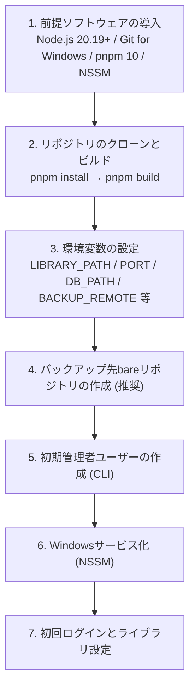

# 06. セットアップ

サーバー導入担当者向けに、初回導入で押さえておくべきポイントをまとめます。詳細な手順は [Windowsセットアップ.md](../導入/Windowsセットアップ.md) に記載されています。

## 6.1 導入の全体像



具体的なコマンド・PowerShell操作は [Windowsセットアップ.md](../導入/Windowsセットアップ.md) を参照してください。

## 6.2 前提ソフトウェア

| ソフトウェア | バージョン | 用途 |
|---|---|---|
| Node.js | 20.19以上(22系推奨) | サーバー実行環境 |
| Git for Windows | 2.30以上 | 履歴管理・バックアップpush(必須) |
| pnpm | 10系(`package.json` でpin) | 依存関係管理 |
| NSSM | 2.24以上 | Windowsサービス化 |

## 6.3 ライブラリフォルダ

TsumiWikiは環境変数 `LIBRARY_PATH` で指定したフォルダを **文書ライブラリ** として扱います。

### 新規に用意する場合

空フォルダを指定するだけです。TsumiWiki初回起動時に自動で以下が行われます:

- `git init` による Git 化
- `.gitignore` の生成(`.obsidian/` `.DS_Store` `Thumbs.db` を除外)
- 初回コミット
- `.tsumiwiki/settings.yaml`(ライブラリ設定)は必要時に作成

### 既存Obsidianヴォルトから移行する場合

そのままコピーするだけで使えます:

```powershell
xcopy /E /I C:\path\to\obsidian-vault C:\tsumiwiki-library
```

対応記法:
- `[[wikilink]]`・`[[link|別名]]`
- `![[画像埋め込み]]`
- インライン `#タグ`
- frontmatterの `tags` フィールド
- Mermaid・GFM表・タスクリスト
- 未知の記法もrawブロックとして原文保持

TsumiWikiが対応していない機能(Dataview実行、プラグインベースの独自記法等)は「表示のみ・実行しない」扱いになりますが、原文は失われません。

## 6.4 初期管理者ユーザーの作成

サーバー初回起動前(または直後)にCLIで管理者を作成します:

```powershell
cd C:\tsumiwiki
node packages/server/dist/cli/index.js create-admin --username admin --display-name "管理者"
# パスワードは対話入力
```

その後、`/admin/users` から他のユーザーを追加できます。運用ヒント:
- 管理者は **最低2名** を推奨(1名だと降格・無効化が全くできなくなる)
- 初期発行後、各ユーザーに `/settings` からパスワードを変更してもらう

## 6.5 バックアップリポジトリ

ファイルサーバー上に bareリポジトリを1回だけ作成します:

```powershell
git init --bare \\fileserver\share\tsumiwiki.git
```

環境変数 `BACKUP_REMOTE` にそのUNCパスを指定して起動すると、定期(既定10分間隔)で自動pushされます。

UNCパスの認証やサービス実行ユーザーの権限については [Windowsセットアップ 4.1](../導入/Windowsセットアップ.md) を参照してください。

## 6.6 初回ログインとライブラリ設定

サービス起動後、ブラウザで `http://<サーバー>:<PORT>/` を開いて管理者でログインします。

### 初回に行っておくとよい設定

1. **ライブラリ設定**(`/admin/library`)
   - テンプレフォルダ: 既定の `_templates` でOK
   - デイリーノート:
     - 作成先フォルダ(例: `日記`)
     - ファイル名パターン(例: `YYYY-MM-DD(aaa)`)
     - テンプレート(必要ならテンプレフォルダに事前作成)
2. **テンプレートの用意**
   - テンプレフォルダ(既定 `_templates`)に `.md` を置く
   - 例: `_templates/議事録.md`、`_templates/日誌.md`
3. **ユーザーの追加**(`/admin/users`)
   - 各利用者を追加、初期パスワードを共有

## 6.7 更新(バージョンアップ)

TsumiWikiのバージョンアップは以下の手順で行います:

```powershell
# サービス停止
nssm stop TsumiWiki

# 最新をpull
cd C:\tsumiwiki
git pull

# 依存関係の再インストールとビルド
pnpm install
pnpm build

# サービス再起動
nssm start TsumiWiki
```

DB マイグレーションが必要な変更が含まれている場合は、リリースノートに従ってください。

## 6.8 動作確認のチェックリスト

導入後、以下の順で動作確認するとスムーズです。

- [ ] ブラウザでログインできる
- [ ] 新規文書を作成→保存できる
- [ ] Git履歴に保存コミットが載っている(`git log` で確認)
- [ ] 検索が動く(日本語3文字以上で試す)
- [ ] 画像をD&Dしてアップロードできる
- [ ] `/admin/library` を開いて設定を1つ変更→保存できる
- [ ] `.tsumiwiki/settings.yaml` が生成され、Gitコミットされている
- [ ] `BACKUP_REMOTE` を設定した場合: 10分待って、bareリポジトリ側で `git log` に反映される
- [ ] Windowsサービスの再起動でも正常起動する

## 6.9 トラブル時の切り分け

- **サーバーが起動しない** → ログファイル(`LOG_FILE`)を確認
- **保存はできるが履歴に載らない** → `git config --global core.autocrlf` が `false` か確認(Windows)
- **push が失敗する** → NSSM実行ユーザーの資格情報(`cmdkey`)を確認
- **ログインが弾かれ続ける** → レート制限(15分/10失敗)に該当している可能性

詳細は [07. トラブルシューティング](07_トラブルシューティング.md) を参照してください。

## 参考

- 詳細手順: [Windowsセットアップ.md](../導入/Windowsセットアップ.md)
- 設計背景: [基本設計 01. アーキテクチャ設計](../設計/01_アーキテクチャ設計.md) / [06. Git連携設計](../設計/06_Git連携設計.md)
- 外部連携: [連携/AIエージェント_直接編集ガイド](../連携/AIエージェント_直接編集ガイド.md) / [連携/HTTP_APIリファレンス](../連携/HTTP_APIリファレンス.md)
